# RoundTable AI — Module-Wise HLD & LLD (Local Docker Deployment)
### Companion #3 — the final, detailed design reference
*Prepared 14 July 2026 · Revision 2 · Team of 1 · Speech Technology Internship Mini-Project*

**Revision 2 adds:** the Upload module (§2.3a), a Frontend Design System module (§2.11),
curriculum-module tags on every module heading below (cross-referenced against the Execution
Plan's §2.6 crosswalk table), and updates the system-wide HLD and cross-module data-flow table
for the new dual recording/upload entry point. Everything else carries over unchanged.

---

## 0. Read order and how this document relates to the other two

1. **Execution Plan** — what to build, the rubric/analytics design and its syllabus mapping,
   phases, the tier list.
2. **Architecture Plan** — the tech stack, why local-first hosting, the DSP microservice's
   library choices, the async job pattern.
3. **This document** — one subsection per module: a high-level flow diagram, the concrete
   low-level sequence, and a state machine where the module has one. Read this when you're
   about to implement a specific module and want the exact shape of its logic, not just the
   "what" or the "why."

---

## 1. System-Wide HLD

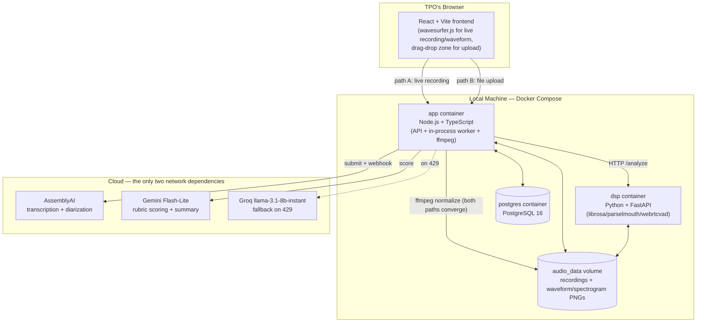

Both entry paths (live record, file upload) converge at the `app` container's normalization
step — from `sessions.status='uploaded'` onward, every module downstream of this diagram is
identical regardless of which path produced the audio (Execution Plan §1a).

---

## 2. Module-by-Module HLD, LLD, and State Machines

### 2.1 Auth Module **[Mod 5 — infrastructure supporting the mini-project's single-user workflow]**

**HLD**
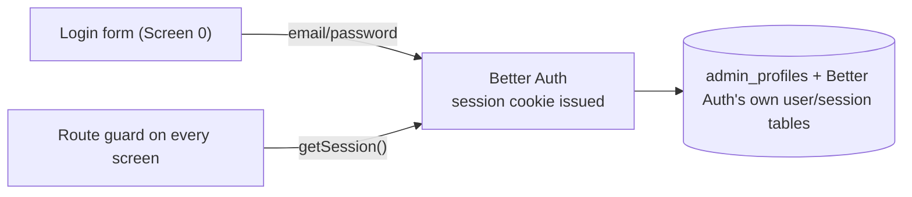

Single role, no signup flow exposed in the UI — the one admin account is created by a seed
script at first boot, not through a public registration form (there is no reason for this
internal tool to expose account creation at all, since exactly one person uses it).

**LLD — seed script**
```ts
// scripts/seed-admin.ts
import { auth } from "@/lib/auth";
import { prisma } from "@/lib/db";

async function main() {
  const existing = await prisma.admin_profiles.findFirst();
  if (existing) {
    console.log("Admin already exists, skipping seed.");
    return;
  }
  const { user } = await auth.api.signUpEmail({
    body: { email: process.env.SEED_ADMIN_EMAIL!, password: process.env.SEED_ADMIN_PASSWORD! },
  });
  await prisma.admin_profiles.create({
    data: { id: user.id, full_name: "TPO Admin", institution_name: process.env.INSTITUTION_NAME ?? "Institution" },
  });
}
main();
```

No state machine — a session is either valid or it isn't.

---

### 2.2 Session Setup Module (Screen 1) **[Mod 5 — "problem identification, basic design"]**

**HLD**
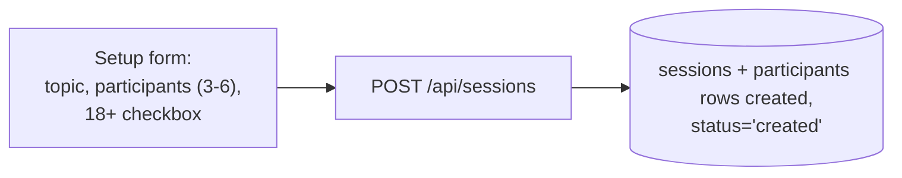

**State machine — `sessions.status`**
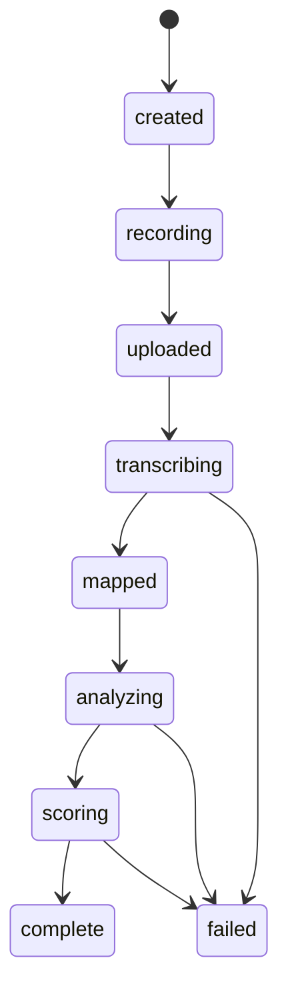

This is the single state machine that governs the whole pipeline — every other module either
reads it (Screen 3's step tracker) or advances it (each job handler moves the session one
state forward on success, or to `failed` with an `error_message` on exhausted retries).

---

### 2.3 Consent + Recording Module (Screen 2) **[Mod 1, Mod 2]**

**HLD — live-record path**
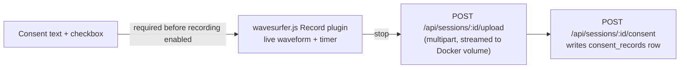

See §2.3a immediately below for the file-upload path — both paths share the same consent gate
and converge on the same normalization step before `ConsentAPI` fires.

**LLD — the recording widget (React + wavesurfer.js v7)**
```tsx
// src/components/RecordingWidget.tsx
import WaveSurfer from "wavesurfer.js";
import RecordPlugin from "wavesurfer.js/dist/plugins/record.js";

export function RecordingWidget({ onStop }: { onStop: (blob: Blob) => void }) {
  const containerRef = useRef<HTMLDivElement>(null);
  const wsRef = useRef<WaveSurfer>();
  const recordRef = useRef<RecordPlugin>();

  useEffect(() => {
    const ws = WaveSurfer.create({ container: containerRef.current!, waveColor: "#334155", height: 80 });
    const record = ws.registerPlugin(RecordPlugin.create({ scrollingWaveform: true }));
    record.on("record-end", (blob) => onStop(blob));
    wsRef.current = ws;
    recordRef.current = record;
    return () => ws.destroy();
  }, []);

  return (
    <div>
      <div ref={containerRef} />
      <button onClick={() => recordRef.current?.startRecording()}>Start</button>
      <button onClick={() => recordRef.current?.stopRecording()}>Stop</button>
    </div>
  );
}
```

**LLD — upload handler (Node)**
```ts
// src/features/sessions/upload.ts
import { writeFile, mkdir } from "fs/promises";

export async function handleUpload(sessionId: string, audioBuffer: Buffer) {
  const dir = `/data/sessions/${sessionId}`;
  await mkdir(dir, { recursive: true });
  const path = `${dir}/recording.wav`;
  await writeFile(path, audioBuffer);
  await prisma.sessions.update({
    where: { id: sessionId },
    data: { audio_local_path: path, status: "uploaded" },
  });
  await prisma.jobs.create({ data: { session_id: sessionId, job_type: "transcription" } });
}
```

Note this writes directly to the Docker named volume mounted at `/data` — no S3-style
presigned-URL dance is needed at all, because there's no separate object-storage service to
hand a URL to; the app container writes the file itself, which the DSP container can then
read from the same shared volume.

---

### 2.3a Upload Recording Module (NEW — Screen 2's second tab) **[Mod 1, Mod 2]**

**HLD**
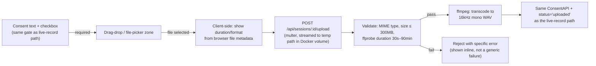

**LLD — the validation + normalization sequence**
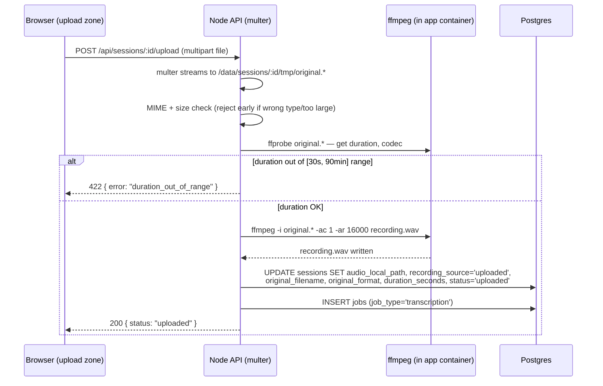

**Why this is a real module and not just "the same upload endpoint with an if-branch":** the
validation step (duration/format check before transcoding) and the normalization step
(transcoding regardless of source) are both real, testable pieces of logic with their own
failure modes — a corrupt file, a wrong format, a file that's actually a 3-hour lecture
recording by mistake — each of which needs to fail loudly and specifically on Screen 2, not
silently produce a broken downstream session. Full code in Architecture Plan §2a.

No independent state machine — this module writes into the same `sessions.status` state
machine as the live-record path (§2.2's diagram), specifically the `created → uploaded`
transition; it does not introduce a new state.

---

### 2.4 Transcription Module **[Mod 3 — speech recognition, speaker diarization]**

**HLD**
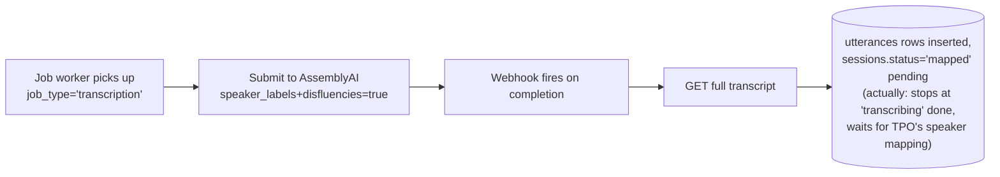

**LLD — sequence**
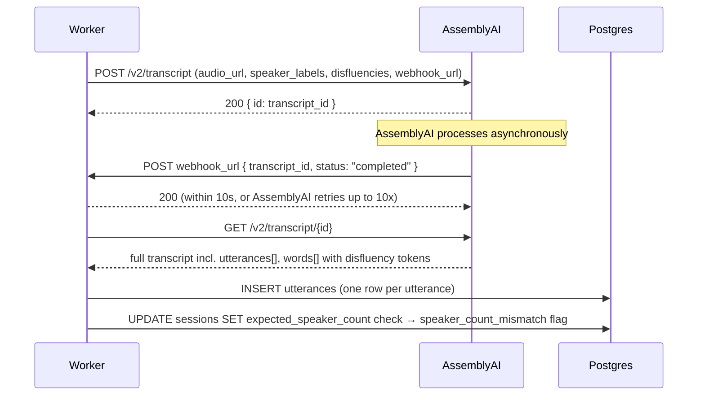

**Speaker-count mismatch check (carried over from the original plan's design, now with a
concrete storage location that the original plan's own Agent-Y run flagged as undefined):**
```ts
const distinctSpeakers = new Set(utterances.map(u => u.speaker_label)).size;
const mismatch = distinctSpeakers !== session.expected_speaker_count;
await prisma.sessions.update({
  where: { id: sessionId },
  data: { speaker_count_mismatch: mismatch }, // stored directly on sessions — resolves the
                                                // exact ambiguity the original plan's own
                                                // agent run stopped and asked about
});
```

---

### 2.5 Speaker Mapping Module (part of Screen 3) **[Mod 3]**

**HLD**
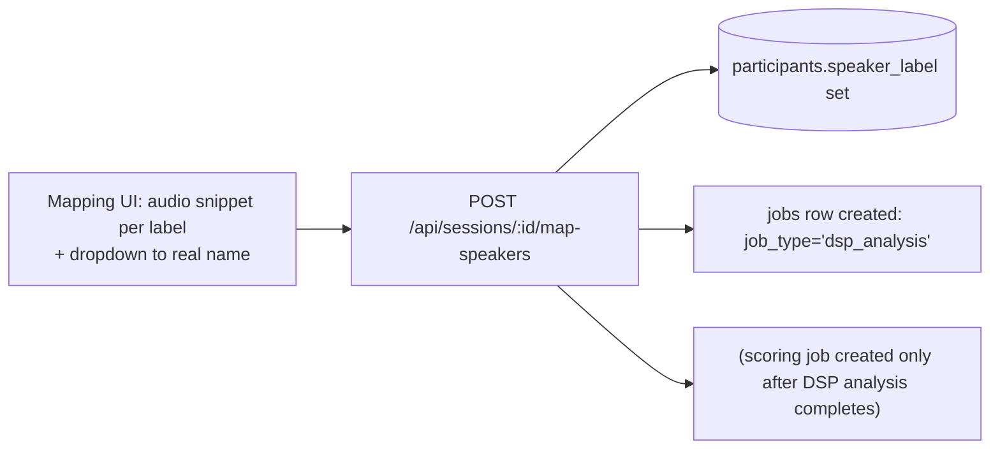

Mapping triggers the DSP analysis job first, not scoring directly — because the LLM prompt
(execution plan §6) needs the Layer B/C analytics numbers as context, so analysis must
complete before scoring starts. This is a real, sequential dependency, not an arbitrary
ordering choice.

---

### 2.6 Speech Analytics Module — Layer C (Node, transcript-derived) **[Mod 2]**

**HLD**
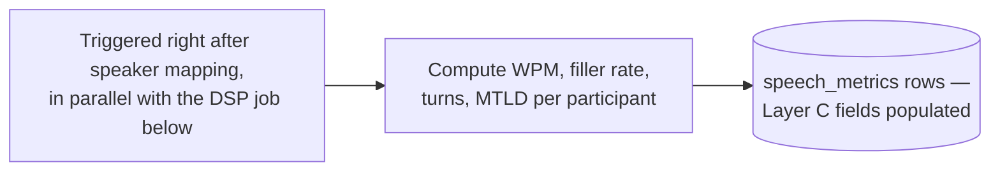

**LLD — the four Layer C computations**
```ts
// src/features/speech-metrics/transcript-derived.ts
const FILLER_TOKENS = new Set(["um", "uh", "hm", "mm", "erm"]);

export function computeLayerC(utterances: Utterance[], sessionDurationMs: number) {
  const words = utterances.flatMap(u => u.text.toLowerCase().split(/\s+/));
  const speakingTimeMs = utterances.reduce((sum, u) => sum + (u.end_ms - u.start_ms), 0);
  const fillerCount = words.filter(w => FILLER_TOKENS.has(w)).length;

  return {
    speaking_time_ms: speakingTimeMs,
    participation_pct: (speakingTimeMs / sessionDurationMs) * 100,
    word_count: words.length,
    wpm: words.length / (speakingTimeMs / 60000),
    filler_count: fillerCount,
    filler_rate: (fillerCount / words.length) * 100,
    turns_count: utterances.length,
    avg_turn_ms: speakingTimeMs / utterances.length,
    vocab_mtld_score: words.length >= 50 ? computeMTLD(words) : null, // null below a
                                                                        // reliable-estimate
                                                                        // threshold, per the
                                                                        // execution plan §2.3
  };
}
```

**MTLD implementation note (the standard factor-based algorithm, not a from-scratch
reinvention):** MTLD works by scanning the word sequence and counting how many words it
takes before the running type-token ratio drops below a fixed threshold (conventionally
0.72), then resets and continues — the final score is the average "factor length." This is
the standard, textbook definition of the metric; use an existing, tested implementation
(e.g., the `lexical-diversity` Python package's approach ported to TS, or a small
well-tested TS implementation) rather than re-deriving the algorithm from a blog post.

---

### 2.7 Speech DSP Module — Layer B (Python microservice) **[Mod 1, Mod 2]**

**HLD**
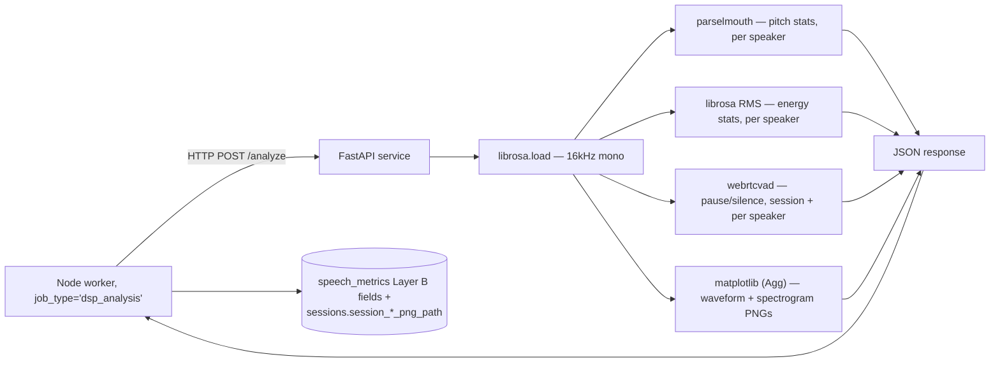

Full LLD and library-selection reasoning already given in the Architecture Plan §3 — this
section exists to place the module in the overall system flow, not duplicate that detail.

---

### 2.8 LLM Scoring Module **[Mod 3, Mod 4]**

**HLD**
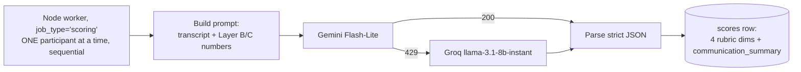

**LLD — sequence, including the fallback path**
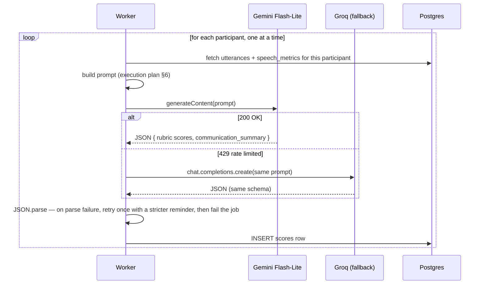

**Why sequential, restated as a concrete number:** 6 participants × 1 call each, one at a
time, at even a conservative 10-second round trip per call, is roughly one minute of total
scoring time per session — nowhere near tripping a 15 RPM ceiling even in the worst case, and
avoids the exact parallel-fan-out failure mode current Gemini free-tier guidance calls out as
the most common way developers accidentally hit a rate limit.

---

### 2.9 Retention & Deletion Module (cross-cutting, scheduled) **[supports consent/compliance discipline, not a syllabus module directly]**

**HLD**
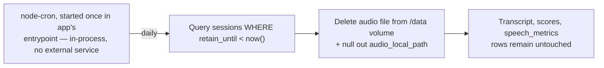

**LLD**
```ts
// src/lib/retention-cron.ts — started once at app boot, same in-process pattern as
// AssetFlow's own local-deployment decision (no external scheduler needed for a single
// long-lived Docker container)
import cron from "node-cron";
import { unlink } from "fs/promises";

export function startRetentionCron() {
  cron.schedule("0 3 * * *", async () => { // once daily, 3am
    const expired = await prisma.sessions.findMany({
      where: { retain_until: { lt: new Date() }, audio_local_path: { not: null } },
    });
    for (const session of expired) {
      await unlink(session.audio_local_path!).catch(() => {}); // already-deleted is fine
      await prisma.sessions.update({ where: { id: session.id }, data: { audio_local_path: null } });
    }
  }, { timezone: "UTC" });
}
```

No `CRON_SECRET` or external HTTP trigger needed at all, unlike a serverless deployment would
require — this container is a long-lived process, so `node-cron` scheduled once at startup is
sufficient and correct, the same verified pattern used for AssetFlow's own final local
deployment.

---

### 2.10 Cohort Dashboard Module (Screen 6, read-only) **[Mod 5 — "report preparation"]**

**HLD**
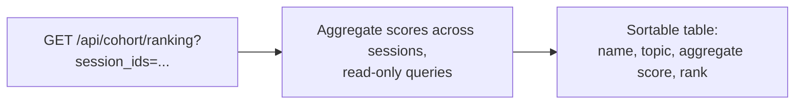

No state machine — read-only, no LLD beyond "run a `GROUP BY`/`ORDER BY` query on render."

---

### 2.11 Frontend Design System Module (NEW, cross-cutting)

**HLD**
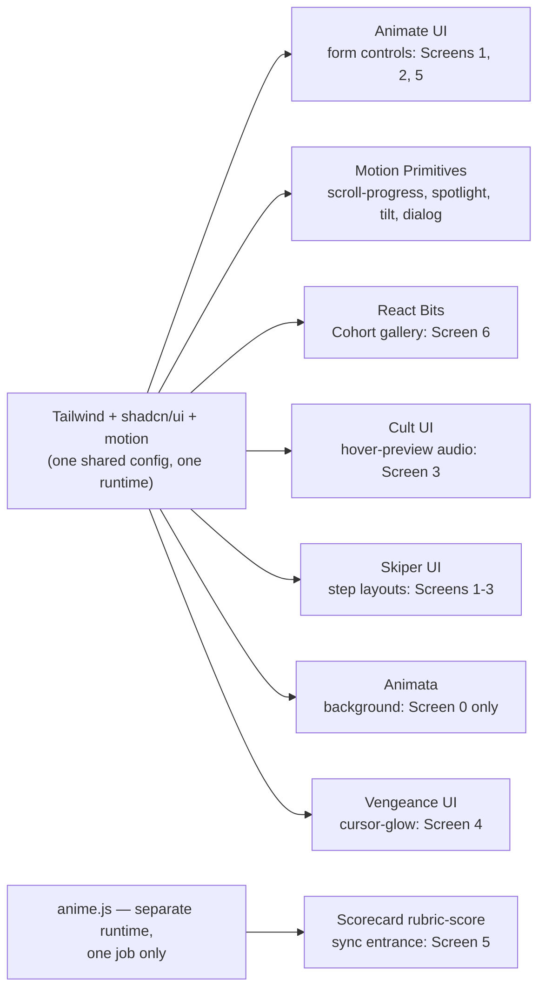

Full per-library rationale in Execution Plan §7.0; full install/composition architecture
(including why every library ships as copied source, not an opaque npm dependency, so there is
no version-conflict risk between them) in Architecture Plan §2b. This section exists only to
place the design system in the same module-by-module format as everything else in this
document — there's no separate LLD or state machine here, since this "module" is a set of
UI components, not a piece of pipeline logic with its own states.

**The one discipline worth restating at this level:** exactly two animation runtimes exist in
the whole frontend (`motion`, used by five of the seven libraries above, and `anime.js`, scoped
to one component) — not seven independent runtimes, which is what naively adopting seven
component libraries without this shared-foundation discipline would produce.

---

## 3. Cross-Module Data Flow — the complete pipeline in one table

| Step | Trigger | Module | Writes to |
|---|---|---|---|
| 1 | TPO submits Session Setup form | Session Setup | `sessions`, `participants` |
| 2 | Recording stops (live path) **or** file dropped and validated (upload path, §2.3a) | Consent + Recording / Upload Recording | `sessions.audio_local_path`, `sessions.recording_source`, `consent_records` |
| 3 | Normalization complete (both paths) | Transcription | `jobs` (transcription queued) |
| 4 | AssemblyAI webhook fires | Transcription | `utterances`, `sessions.speaker_count_mismatch` |
| 5 | TPO maps speakers | Speaker Mapping | `participants.speaker_label`, `jobs` (dsp_analysis queued) |
| 6 | DSP job picked up | Speech DSP (Layer B) + Speech Analytics (Layer C, runs alongside) | `speech_metrics`, `sessions.session_*_png_path` |
| 7 | Analysis complete | Scoring | `jobs` (scoring queued, one per participant) |
| 8 | Scoring jobs complete | LLM Scoring | `scores` |
| 9 | All participants scored | — | `sessions.status = 'complete'` |
| 10 | TPO views Scorecard/Signal Lab/Cohort Dashboard | Read-only | — |
| 11 | `retain_until` passes | Retention Cron | deletes audio file, nulls `audio_local_path` |

---

## 4. Deployment HLD — the whole environment, final

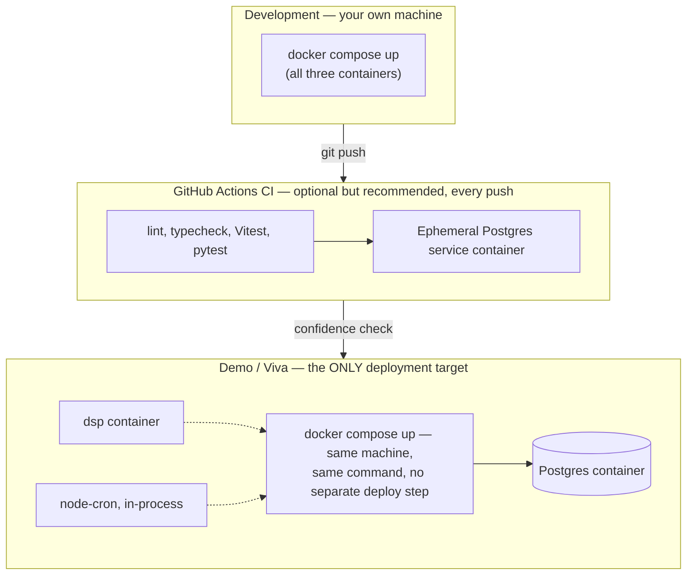

There is no separate "production" environment distinct from the demo target — deliberate, and
matches a solo 1–2 week scope exactly. The demo *is* `docker compose up`, run on the same
machine the whole project was built on, which is precisely what eliminates the "did the
deploy step introduce a new failure" risk class entirely.

---

## 5. What's Locked — No More Re-Litigating

1. **Hosting is Docker Compose, one machine, final** — not a primary-with-a-cloud-alternative.
   The only network calls during a live demo are to AssemblyAI and Gemini/Groq.
2. **The Python DSP microservice is Tier 1**, not a stretch goal — it is what makes the
   syllabus-alignment claim in the execution plan's §2 true rather than aspirational.
3. **AssemblyAI's `disfluencies: true` flag is the filler-word detector** — no custom regex or
   heuristic detector gets built; this was confirmed against current AssemblyAI documentation,
   not assumed.
4. **Scoring calls are sequential, Flash-Lite primary, Groq fallback** — this is a rate-limit
   decision grounded in this project's actual verified free-tier numbers, not a generic
   "use whichever LLM" choice.
5. **The acoustic-signal layer never produces a psychological or evaluative claim on its own**
   — pitch/energy numbers are presented as neutral measurements; the LLM's communication
   summary is the only place evaluative language appears, and it must ground that language in
   the transcript and the provided numbers, per the execution plan's §1 fairness constraint.
6. **Recording has exactly two entry points — live capture and file upload — both normalized
   to the same 16kHz mono WAV before anything downstream runs.** No third entry point (e.g.
   pulling audio from a URL) is in scope.
7. **The frontend design system is one shared Tailwind/`shadcn`/`motion` foundation with named
   libraries layered on top for specific, bounded purposes** — not seven independently-adopted
   frameworks. `anime.js` is the one deliberate second animation runtime, scoped to one
   component (Execution Plan §7.0, Architecture Plan §2b).

If anyone reads the original 8-week plan after this one, tell them explicitly: its rubric
philosophy (§2 of that document) and its consent/retention discipline (§8) are still correct
and are restated here in updated form — only its team size, timeline, and hosting decisions
are superseded.

---

## Sources Consulted (14 July 2026)

Render official docs and independent 2026 trackers (ephemeral filesystem, 15-minute spin-down,
30-day Postgres expiry); AssemblyAI official docs (webhooks for pre-recorded audio, the
`disfluencies` parameter, Universal-2/Universal-3 Pro model behavior, free-tier credit terms);
Google Gemini API free-tier rate-limit guidance, cross-checked across five independent 2026
trackers given how frequently these limits have changed this year; Groq official rate-limit
documentation; Lucia's own deprecation announcement and current (2026) Node.js auth-library
guidance recommending Better Auth; open-source speech-feature-extraction library comparisons
recommending `librosa` + `parselmouth` + a lightweight VAD for exactly this kind of
prosodic/energy/pause analysis; `wavesurfer.js` official documentation and GitHub repository
confirming the Record and Spectrogram plugins are both current, maintained, first-party
plugins as of v7; `multer` and `fluent-ffmpeg` official documentation for the upload/
normalization module (§2.3a); frontend component library sites verified directly (14 July
2026) for the design-system module (§2.11): reactbits.dev, animate-ui.com, motion-primitives.com,
cult-ui.com, skiper-ui.com, animata.design, animejs.com, app.iconsax.io. All diagrams, schemas,
and code samples are original to this project.
